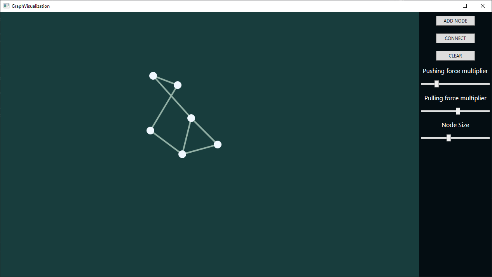
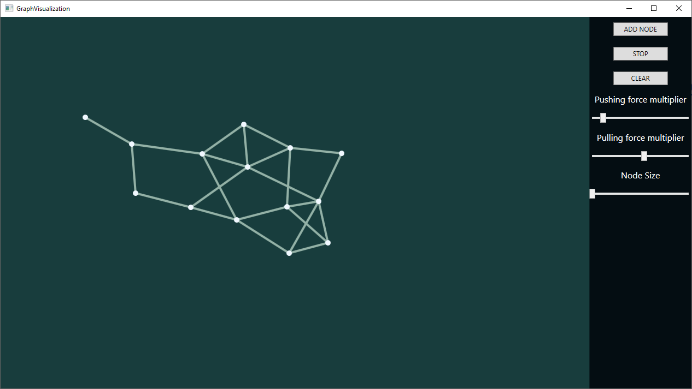

# GraphVisualization

It's a program that allows you to add and connect nodes between eachother making a graph structure.

You can controll pushing and pulling forces between nodes (connected nodes are pulled together and not connected are being pushed away) and visual size of the nodes.

Application is inspired by graph mode in [Obsidian](https://obsidian.md/) note-taking app.